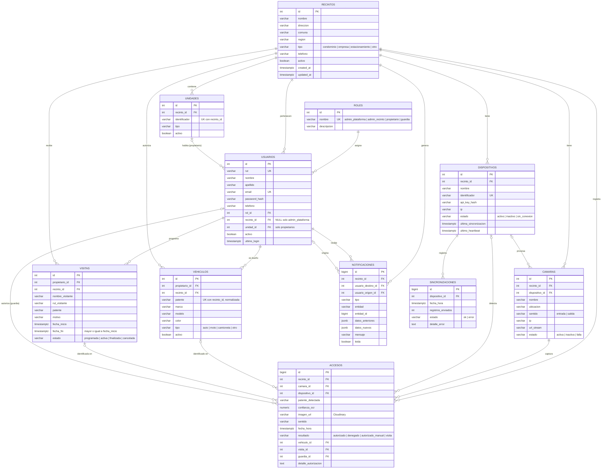

# Modelo Entidad-Relación – SegurIA-LPR

El script completo está en [`sql/schema.sql`](../sql/schema.sql).

## Tablas

| Tabla | Descripción |
|---|---|
| **roles** | Los 4 roles del sistema. Cada usuario tiene exactamente uno. |
| **recintos** | Lugares controlados (condominio, empresa, estacionamiento). Se desactivan en vez de borrarse para conservar el historial. |
| **unidades** | Departamentos, casas u oficinas de un recinto. El identificador es único dentro del recinto. |
| **usuarios** | Administradores, propietarios y guardias. Contraseña con hash bcrypt. Un trigger obliga a que solo `admin_plataforma` no tenga recinto y que solo los propietarios tengan unidad (de su mismo recinto). |
| **vehiculos** | Vehículos autorizados de cada propietario. La patente se normaliza (mayúsculas, sin guiones) y es única por recinto. |
| **visitas** | Visitas programadas por un propietario. Si traen patente, queda autorizada mientras estén vigentes. |
| **dispositivos** | Raspberry Pi de cada recinto. Se autentican con una API key (se guarda solo su hash) y reportan heartbeat. |
| **camaras** | Cámaras IP conectadas a un dispositivo; cada una controla una entrada o una salida. |
| **accesos** | Historial de detecciones con su resultado. La imagen se guarda en Cloudinary (solo la URL). Si el resultado es `autorizado_manual`, el guardia y el detalle son obligatorios (CHECK). |
| **notificaciones** | Avisos al administrador (ej. un propietario editó un vehículo), con datos anteriores y nuevos en JSONB. |
| **sincronizaciones** | Bitácora de cada envío de patentes autorizadas a una Raspberry Pi. |

## Otros objetos

- **`fn_actualizar_updated_at()`** + triggers `trg_*_updated_at`: actualizan `updated_at` en cada UPDATE.
- **`fn_normalizar_patente()`** + triggers: guardan las patentes en mayúsculas y sin guiones ni espacios.
- **`fn_validar_usuario()`**: valida la combinación rol / recinto / unidad.
- **`vw_patentes_autorizadas`**: patentes de vehículos activos (de propietarios activos) más visitas programadas/activas vigentes, por recinto. Es lo que se sincroniza con cada Raspberry Pi.

## Criterios de borrado (ON DELETE)

- Borrar un **recinto** elimina en cascada unidades, cámaras, dispositivos, vehículos y visitas, pero queda **bloqueado** (`RESTRICT`) si tiene usuarios o accesos. En la práctica los recintos y usuarios se **desactivan** (`activo = false`).
- Los **accesos** nunca se pierden al borrar vehículos, visitas o dispositivos (`SET NULL`); la cámara y el guardia que autorizó están protegidos (`RESTRICT`).
