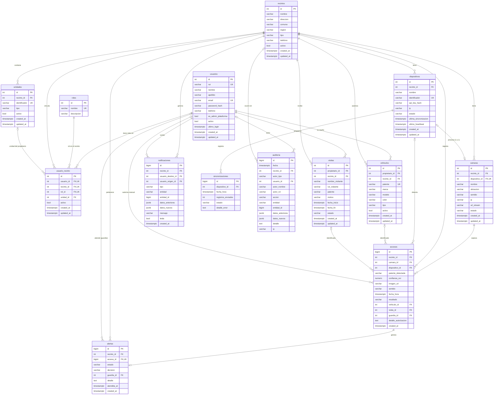

# Modelo Entidad-Relación – SegurIA-LPR

El script completo está en [`sql/schema.sql`](../sql/schema.sql). Imagen del MER final con los cambios respecto al MER
original de la HU-6: [`documentation/SegurIA-LPR_MER_final.png`](../documentation/SegurIA-LPR_MER_final.png).

## Tablas

| Tabla | Descripción |
|---|---|
| **roles** | Roles que se asignan dentro de un recinto: admin_recinto, guardia y propietario. Una persona puede tener varios (en `usuario_recinto`). |
| **recintos** | Lugares controlados (condominio, empresa, estacionamiento). Se desactivan en vez de borrarse; un recinto inactivo bloquea el ingreso de sus usuarios. |
| **unidades** | Departamentos, casas u oficinas de un recinto. El identificador es único dentro del recinto. |
| **usuarios** | Una cuenta por persona (un email, un RUT y una contraseña con hash bcrypt). No guarda roles ni recintos: eso está en `usuario_recinto`. `es_admin_plataforma` marca al administrador de plataforma. |
| **usuario_recinto** | Roles de cada persona en cada recinto: una fila por recinto + rol, con la unidad (solo en el rol propietario) y su estado. Así una misma cuenta puede administrar 3 recintos, ser guardia en 2 y propietaria en 1, y al iniciar sesión elige con qué perfil entrar (HU-19, HU-20). Único: (usuario, recinto, rol). El admin de plataforma no se vincula (HU-22). Un trigger valida rol, unidad y recinto. |
| **vehiculos** | Vehículos de cada propietario en un recinto. Patente normalizada y única por recinto. |
| **visitas** | Visitas con ventana horaria: hasta 24 h si las programa el propietario, hasta 30 días el admin (HU-28). Si traen patente, queda autorizada mientras estén vigentes. |
| **dispositivos** | Raspberry Pi de cada recinto (API key con hash, último heartbeat y última sincronización). Cada equipo atiende **una sola cámara** (relación 1 a 1); un equipo sin cámara queda pendiente de asignación. |
| **camaras** | Cámaras IP; cada una controla una entrada o una salida. `dispositivo_id` es único (1 a 1 con la Raspberry Pi) y opcional: sin equipo, la cámara queda **pendiente de asignación** y no se usa (no registra accesos ni aparece en el monitor del guardia). |
| **accesos** | Historial de detecciones con su resultado. La captura se guarda en Cloudinary como privada (solo la URL en la BD) y se elimina a los 60 días (HU-32). |
| **alertas** | Una por cada acceso denegado. El guardia la atiende autorizando (detalle obligatorio) o rechazando; queda pendiente o atendida con la decisión (HU-31). |
| **notificaciones** | Avisos en tiempo real al administrador (cambios de propietarios, visitas, accesos no autorizados). |
| **sincronizaciones** | Bitácora de cada envío de patentes a una Raspberry Pi por Socket.io (HU-36). |
| **auditoria** | Bitácora inmutable de cada creación, edición o eliminación: autor (usuario, equipo o sistema), acción, entidad, datos antes/después, recinto, fecha e IP (HU-5). |

## Otros objetos

- **`fn_actualizar_updated_at()`** + triggers `trg_*_updated_at`: actualizan `updated_at` en cada UPDATE.
- **`fn_normalizar_patente()`** + triggers: guardan las patentes en mayúsculas y sin guiones ni espacios.
- **`fn_validar_usuario_recinto()`**: impide vincular al admin de plataforma, exige unidad en el rol propietario (y solo en ese rol) y que la unidad sea del mismo recinto.
- **`fn_auditoria_inmutable()`**: impide `UPDATE`, `DELETE` y `TRUNCATE` sobre `auditoria`.
- **`vw_patentes_autorizadas`**: vehículos activos de propietarios activos en el recinto + visitas vigentes. Es lo que se sincroniza con cada Raspberry Pi.

## Cambios respecto al MER original (HU-6)

- **Implementadas tal como se diseñaron:** `usuario_recinto` (con `unidad_id` en vez de `numero_vivienda` y con `rol_id`: el rol se asigna por recinto), `alertas` y `auditoria`.
- **Modificadas:** las tablas ADMIN, PROPIETARIO y GUARDIA se reemplazaron por una sola cuenta en `usuarios` + `roles` asignados por recinto en `usuario_recinto`; VEHICULO perdió `es_visita`/`fecha_expiracion` (ahora tabla `visitas`) y `registrado_por` (lo cubre la auditoría); PROCESADOR pasó a `dispositivos`, manteniendo la relación 1 a 1 con la cámara pero opcional (cámara o equipo sin pareja = pendiente de asignación); REGISTRO_ACCESO pasó a `accesos` con más datos.
- **Nuevas:** `roles`, `unidades`, `visitas`, `notificaciones` y `sincronizaciones`.

## Criterios de borrado (ON DELETE)

- Los recintos y usuarios **no se borran, se desactivan**. Borrar un recinto queda bloqueado si tiene usuarios, accesos o auditoría.
- Los **accesos** se conservan aunque se borren vehículos, visitas o equipos (`SET NULL`); la cámara y el guardia que autorizó están protegidos (`RESTRICT`).
- La **auditoría** no se puede modificar ni borrar.
